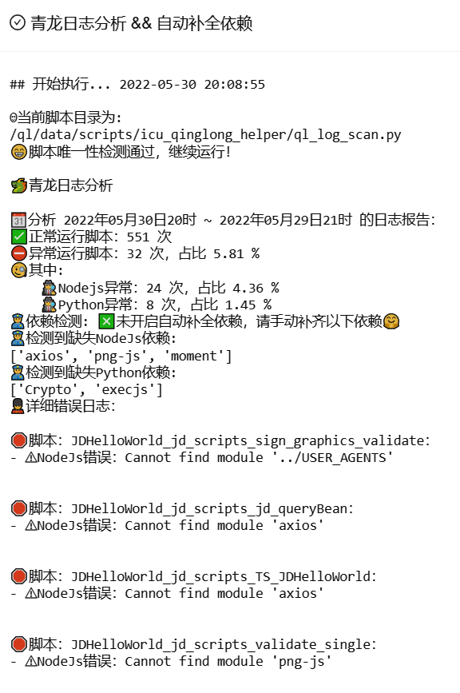
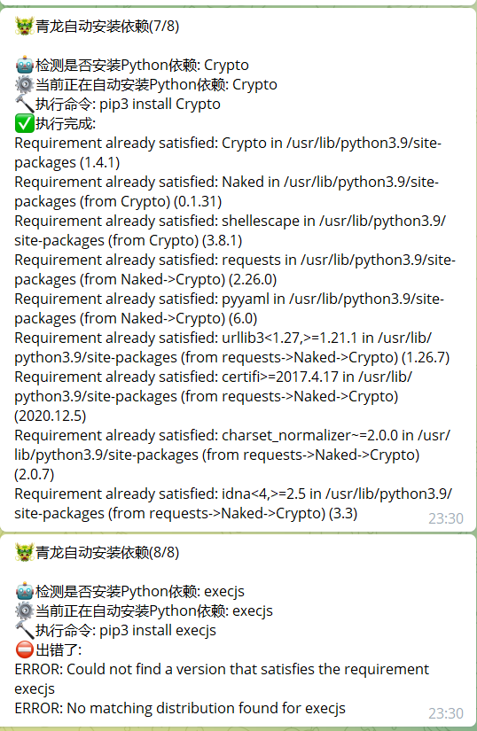

# 青龙脚本小工具

## 介绍
自用工具，写的烂勿喷。
本仓库遵循自写自用原则，我自己不需要的东西大概率不会去写，慎重提交issues，合理的建议我会采纳。
文件 | 功能
---- | ----
ql_log_scan.py | 青龙日志扫描归纳 && 自动补全依赖
depend.py | 脚本依赖文件(把一些基础函数功能分离到这里，未来打算再写一个自动禁用重复的脚本，根据git日志谁的文件新，和日志是否存在报错或者活动火爆等多维度判断禁用)
depend.json | 提供依赖间的映射关系(目前没有用到，是Future)
## 截图
#### 日志分析

#### 自动补全依赖(默认未开启)
